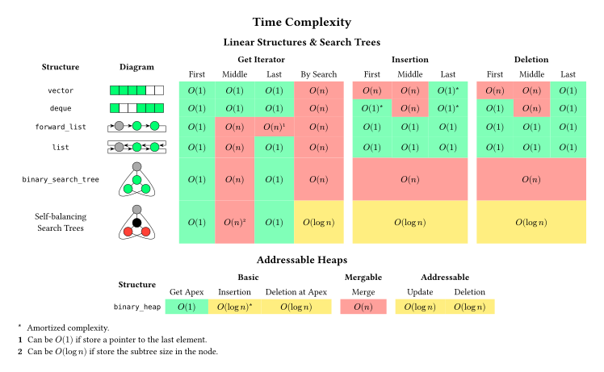

# Plastic

My implementations of common data structures and algorithms for study.

## Data Structures

The class designs are primarily based on the standard library, but not identical. For example, the underlying structure of `deque` is implemented as a bidirectional dynamic array instead of blocks.

| | **`inplace_vector` `vector`** | **`inplace_deque` `deque`** | **`forward_list`** | **`list`** | Search Trees | Addressable Heaps |
| :--: | :--: | :--: | :--: | :--: | :--: | :--: |
| **`empty`** | `empty` | `empty` | `empty` | `empty` | `empty` | `empty` |
| **`size`** | `size` | `size` | `size` | `size` | `size` | `size` |
| **`max_size`** | `max_size` | `max_size` | `max_size` | `max_size` | `max_size` | `max_size` |
| **`clear`** | `clear` | `clear` | `clear` | `clear` | `clear` | `clear` |
| **`resize`** | `resize` | `resize` | `resize` | `resize` | | |
| **`capacity`** | `capacity` | `capacity` | | | | |
| **`reserve`** | `reserve` | `reserve` | | | | |
| **`before_begin`** | | | `before_begin` | | | |
| **`begin`** | `begin` | `begin` | `begin` | `begin` | `begin` | `apex` |
| **`end`** | `end` | `end` | `end` | `end` | `end` | |
| **`cbefore_begin`** | | | `cbefore_begin` | | | |
| **`cbegin`** | `cbegin` | `cbegin` | `cbegin` | `cbegin` | `cbegin` | `capex` |
| **`cend`** | `cend` | `cend` | `cend` | `cend` | `cend` | |
| **`rbegin`** | `rbegin` | `rbegin` | | `rbegin` | `rbegin` | |
| **`rend`** | `rend` | `rend` | | `rend` | `rend` | |
| **`crbegin`** | `crbegin` | `crbegin` | | `crbegin` | `crbegin` | |
| **`crend`** | `crend` | `crend` | | `crend` | `crend` | |
| **`front`** | `front` | `front` | `front` | `front` | `front` | `top` |
| **`back`** | `back` | `back` | | `back` | `back` | |
| **`data`** | `data` | `deque::data` | | | | |
| **`operator[]`** | `operator[]` | `operator[]` | | | | |
| **`contains`** | | | | | `contains` | |
| **`find`** | | | | | `find` | |
| **`count`** | | | | | `count` | |
| **`lower_bound`** | | | | | `lower_bound` | |
| **`upper_bound`** | | | | | `upper_bound` | |
| **`equal_range`** | | | | | `equal_range` | |
| **`push_front`** | | `push_front` | `push_front` | `push_front` | | |
| **`pop_front`** | | `pop_front` | `pop_front` | `pop_front` | | `pop` |
| **`push_back`** | `push_back` | `push_back` | | `push_back` | | |
| **`pop_back`** | `pop_back` | `pop_back` | | `pop_back` | | |
| **`insert`** | `insert` | `insert` | `insert_after` | `insert` | `insert` | `push` |
| **`erase`** | `erase` | `erase` | `erase_after` | `erase` | `erase` | `erase` |
| **`swap`** | `swap` | `swap` | `swap` | `swap` | `swap` | `swap` |
| **`merge`** | | | | | `merge` | `merge` |
| **`operator==`** | `operator==` | `operator==` | `operator==` | `operator==` | `operator==` | |
| **`operator<=>`** | `operator<=>` | `operator<=>` | `operator<=>` | `operator<=>` | `operator<=>` | |

## Algorithms

Same as the [standard algorithms](https://eel.is/c++draft/#algorithms) in namespace `ranges`, but without optimizations.

| **Category** | **Operations** |
| -- | -- |
| Non-modifying Sequence | `all_of`, `any_of`, `none_of`, `contains`, `contains_subrange`, `for_each`, `for_each_n`, `find`, `find_if`, `find_if_not`, `find_last`, `find_last_if`, `find_last_if_not`, `find_end`, `find_first_of`, `adjacent_find`, `count`, `count_if`, `mismatch`, `equal`, `is_permutation`, `search`, `search_n`, `starts_with`, `ends_with`, `fold_left`, `fold_left_first`, `fold_right`, `fold_right_last`, `fold_left_with_iter`, `fold_left_first_with_iter` |
| Mutating Sequence | `copy`, `copy_n`, `copy_if`, `copy_backward`, `move`, `move_backward`, `swap_ranges`, `transform`, `replace`, `replace_if`, `replace_copy`, `replace_copy_if`, `fill`, `fill_n`, `generate`, `generate_n`, `remove`, `remove_if`, `remove_copy`, `remove_copy_if`, `unique`, `unique_copy`, `reverse`, `reverse_copy`, `rotate`, `rotate_copy`, `sample`, `shuffle`, `shift_left`, `shift_right` |
| Sorting | `sort`, `stable_sort`, `partial_sort`, `partial_sort_copy`, `is_sorted`, `is_sorted_until` |
| Nth element | `nth_element` |
| Binary Search | `lower_bound`, `upper_bound`, `equal_range`, `binary_search` |
| Partitioning | `is_partitioned`, `partition`, `stable_partition`, `partition_copy`, `partition_point` |
| Merge | `merge`, `inplace_merge` |
| Set | `includes`, `set_union`, `set_intersection`, `set_difference`, `set_symmetric_difference` |
| Heap | `push_heap`, `pop_heap`, `make_heap`, `sort_heap`, `is_heap`, `is_heap_until` |
| Minimum and Maximum | `min`, `max`, `minmax`, `min_element`, `max_element`, `minmax_element` |
| Bounded Value | `clamp` |
| Lexicographical Comparison | `lexicographical_compare` |
| Permutation | `next_permutation`, `prev_permutation` |
